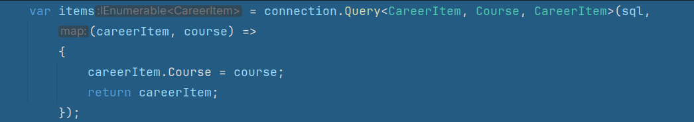
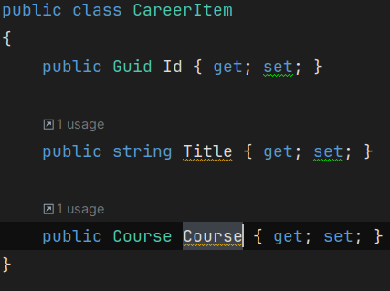
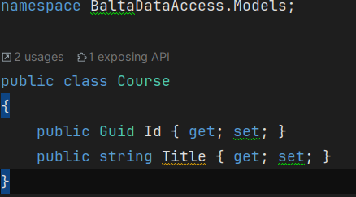

# Anotações

## Sobre query envolvendo duas tabelas

Um exemplo que esclareceu bem como trabalhar com objetos:
Tenho duas classes, CareerItem e Courses.
Cada CareerItem possui um Course, pra retornar uma consulta via join
é utilizada uma função que entra com os tipos classe, recebe um resultado da query que são as duas classes juntas
e Retorna só careerItem

