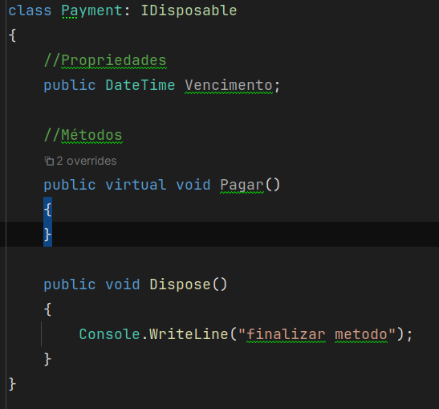
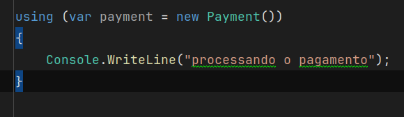
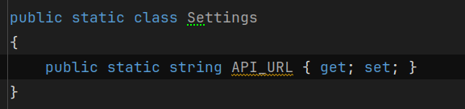

# Anotações de Fundamentos de orientação a objetos

## Objetos
São compostos de:
 - Propriedades
 - Métodos 
 - Eventos(ao clicar o mouse, ao encher a garrafa)

Objeto é sempre um tipo de *Referência*. Só armazena o endereço dos dados.

O objetivo de orientação a objetos é dividir grandes problemas em pequenos objetos e facilitar na resolução.

## Encapsulamento

Agrupar o que faz sentido estar junto.

## Abstração

Esconder os detalhes.

## Herança

A capacidade de um objeto herdar propriedades, métodos e eventos de outro objeto.

## Polimorfismo

Um objeto, um método que pode ter variadas formas.
Exemplo um método herdado e sobrescrito.

No Csharp utilizar o virtual pra sobrescrever um método.

## Modifiadores de acesso

 - private - Visivel somente dentro da classe. utilizar _ antes do nome da propriedade.
 - protected - Visivel somente para os filhos da classe. Usar base.
 - internal - Visivel dentro do mesmo namespace(pouco usado)
 - public - Visivel como um todo

No Csharp o padrão de classes é private.

base é utilizado para acessar métodos da classe pai.

## Propriedades

Utilizar o prop.
Existe o propg e o propfull

Podemos manipular dados no get e no set de uma propriedade se necessário;

## Métodos

"**A instância é a criação do objeto a partir do molde que é a Classe**" instância é acionado com new.

Método construtor
É um método que tem o mesmo nome da classe e não possui retorno.
é acionado com ctor

## Using and Dispose

Dispose fecha/encerra um espaço de um método/classe

A classe deve ter implementado uma interface IDisposable

E quem for utilizar, fazer uso dentro de um using() pra garantir o Dispose().

## Classes Estáticas

static - classes que não podem ser instanciadas e já ficam disponiveis na aplicação a aprtir do start da aplicação.
Classes estáticas tem métodos e propriedades estáticas.

Exemplo:

## Classes Seladas
Impedem q classes herdem da classe selada.

## Classes Parciais
Classes que podem ser segmentadas em mais de um arquivo.

## Interfaces
São definições de contratos de classes.
Interfaces não contém implementação.
Não se utiliza os modificadores de acesso em interface.

## Classes Abstratas
São classes que não podem ser instanciadas, mas podem servir de classe mãe de outras.

Por exemplo, se eu tiver uma interface IPagamento, e uma classe Pagamento, pagamento seria abstrata, pq pagamento por si só, é abstrato, vc pode ter pagamento em dinheiro, em débito, em cartão de crédito, mas só pagamento não faz sentido, logo pagamento pra esse exemplo é uma classe abstrata.

Classes abstratas podem ter uma implementação base, uma validação básica de dados de propriedades.

## Upcast e Downcast
É a conversão de classes mãe em classes filha e de classes filhas em classes mãe.

## Comparando objetos

Quando necessário, implementar a interface IEquatable<nome_classe>

VAi gerar um método equals que terá as regras para comparação do objeto.

## Delegates
Conhecidos como Anonymous methods
no método adiciona o marcador delegate;
é necessário a mesma assinatura para o novo método.
quando instanciar adiciona o nome da função que será a responsavel por executar.
Delegate é delegar a responsabilidade de implemntar e executar a uma outra função qualquer.

## Events
Eventos são sempre utilizado junto com delegates

