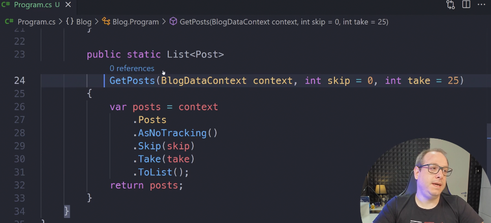

# Anotações

## Iniciando o projeto

 - Dificuldades em iniciar pq estava usando .NET 7.0 e tentando instalar o EntityFrameworkCore sem determinar a versão.
 - Resolvi determinando a versão dotnet add package EntityFrameworkCore --version 7.0.15
 - https://dotnet.microsoft.com/en-us/download/dotnet

## CRUD
 - Somente em Insert usamos o new <Model>
 - Em update e delete consultamos a base de dados d contexto, atualizamos e **Sempre Salvamos**
 - Em Consultas, sempre utilizamos o .ToList() isso garante que a query foi executada;
 - O comando ToList() é sempre o último a ser executado, queries de filtro vem antes, pq está montando o texto.

## As no Tracking
 - Depois de montar a consulta do contexto, utilizar o *AsNoTracking()* auxilia na performance, evitando trazer metadados
 - Usar AsNoTracking só em leituras de tabela simples. Quando tiver Join e/ou um update ou delete, **NÃO UTILIZAR!!**
 - Quando for uma consulta específica antes de fazer um update ou delete, **NÃO UTILIZAR!!**

## First, Single
 - First(traz o item e se não existir, levanta erro)
 - FirstOrDefault(traz o item e se não existir, retorna nulo)
 - Single(age igual First mas se houver mais de um reg com a mesma chave, retorna erro)

## Mapeamento
 - Por convenção classes e nomes de arquivos no **SINGULAR**.
### Data Annotations
 - Data Annotations servem pra gerar os metadados das classes.
 - "[Table]" é um Data Annotation 

 - Data Annotations dependem da biblioteca EntityFrameworkCore
 - Data Annotations poluem muito as classes

### Fluent Mapping
- Criada uma classe externa exclusiva pra mapear. 
- Não polui a classe principal
- Mudar tipo de dados fica na classe mapping, regras de negocio fica na classe principal

## Migration
 - Após criar os Mappings das entidades, podemos fazer o migration que cria o banco de dados
 - Pode ser necessário adicionar o pacote Microsoft.EntityFrameworkCore.Design
 - Utilizar o comando dotnet tool install --global dotnet-ef dentro do projeto(aparentemente)
 - Antes do migration: dotnet clean, dotnet build
 - criar o script de migração: dotnet ef migrations add InitialCreation 
 - atualizar o banco, com base no ultimo snapshot: dotnet ef database update
 - Sempre que remover alguma versão, lembrar de atualizar o banco!!!
 - Se quiser gerar um script pra que seja aplicado no banco: dotnet ef migrations script -o ./scriptXPTO.sql

## Organização do projeto até aqui
- No diretório Data criar um arquivo com o nome do modelo ou projeto que será utilizado(Context)
- Esse arquivo herda de DB context, organiza as entidades que serão utilizadas
- Tambem sobrescreve um método que contém as config do banco de dados
- Criar tbem os modelos das entidades no diretório models
- Dentro do diretório Data criar o mapping e fazer o mapeamento do modelo
- executar o migration e update database

## Lazy Loading
- tem que utilizar o virtual na propriedade na tabela, mas isso acaba demandando mais acessos ao banco de dados
- preferir utilizar o include, que vai gerar um inner join e buscar as informações necessárias uma vez só no banco

 
## Paginação utilizando Skip e Take
- Utilizar paramentros skip e take nas funções de consulta

## Then Include
- utilizado para selecionar infos de tabelas filhas. Utilizar com moderação pq faz novos acessos a base de dados

## Mapeando queries específicas e views
- Existem mais configurações pra fazer uma query específica ou acessar uma view com o ef, mas esse print mostra o principal

